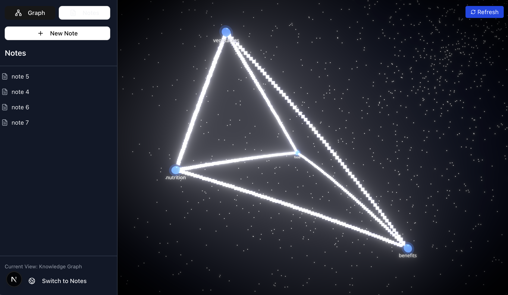

# Neptune - AI-Powered Knowledge Graph for Notes

> Transform your scattered notes into an intelligent, visual knowledge network using AI

[](https://nextjs.org/)
[](https://fastapi.tiangolo.com/)
[](https://postgresql.org/)
[](https://docs.pmnd.rs/react-three-fiber)

## Overview

Neptune solves a critical problem faced by knowledge workers and students: **getting lost in lengthy notes** and struggling to see how ideas connect. Instead of spending time manually organizing notes, Neptune automatically generates an **AI-powered 3D knowledge graph** that visualizes relationships between your concepts.


*AI-generated knowledge graph showing interconnected topics from your notes*

## Key Features

- **AI Topic Extraction**: Leverages LLM to automatically identify key concepts from your notes
- **Smart Relationship Mapping**: Calculates semantic relationships between topics using advanced NLP
- **Interactive 3D Visualization**: Beautiful WebGL-based knowledge graph with smooth animations
- **Real-time Note Editing**: Instant save functionality with live content updates
- **Background Processing**: Non-blocking AI analysis keeps the UI responsive
- **Relationship Strength**: Visual connection weights based on content similarity
- **Topic Clustering**: Automatically groups related notes under common themes

## Technical Architecture

### Frontend Stack
- **Next.js 14** with TypeScript for type-safe React development
- **React Three Fiber** for 3D knowledge graph visualization
- **Three.js** for WebGL rendering and interactive animations
- **Tailwind CSS** for responsive, modern UI design
- **Lucide React** for consistent iconography

### Backend Stack
- **FastAPI** for high-performance async API endpoints
- **SQLAlchemy** with PostgreSQL for robust data persistence
- **Pydantic** for request/response validation and serialization
- **NetworkX** for graph data structure and analysis
- **Threading** for non-blocking background AI processing

### AI/ML Pipeline
- **Ollama** integration for local LLM inference
- **Custom prompt engineering** for topic extraction and relationship scoring
- **Semantic similarity analysis** for intelligent content clustering
- **Graph algorithms** for relationship strength calculation

## Project Structure

```
neptune/
├── neptune-frontend/          # Next.js frontend application
│   ├── app/                   # App router with layout and pages
│   ├── components/            # Reusable React components
│   │   ├── KnowledgeGraph.js  # 3D graph visualization
│   │   ├── NotesDisplay.js    # Rich text note editor
│   │   ├── FileSystemDisplay.js # File management interface
│   │   └── ui/                # Shared UI components
│   └── package.json
│
├── neptune-backend/           # FastAPI backend service
│   ├── app/
│   │   ├── api/routes/        # REST API endpoints
│   │   │   ├── filesystem.py  # File CRUD operations
│   │   │   └── knowledge_graph.py # Graph generation
│   │   ├── services/          # Business logic layer
│   │   │   ├── llm_service.py # AI/LLM integration
│   │   │   ├── knowledge_graph.py # Graph processing
│   │   │   └── visualize_topics.py # Relationship analysis
│   │   ├── db/                # Database models and connection
│   │   └── schemas/           # Pydantic data models
│   └── requirements.txt
│
└── README.md
```

## Installation & Setup

### Prerequisites
- Node.js 18+ and npm
- Python 3.9+
- PostgreSQL
- Ollama (for local LLM)

### Backend Setup
```bash
# Clone and navigate to backend
cd neptune-backend

# Create virtual environment
python3 -m venv venv
source venv/bin/activate  # On Windows: venv\Scripts\activate

# Install dependencies
pip install -r requirements.txt

# Set up environment variables
cp .env.example .env
# Configure DATABASE_URL and OLLAMA_URL in .env

# Start the server
uvicorn app.main:app --reload
```

### Frontend Setup
```bash
# Navigate to frontend
cd neptune-frontend

# Install dependencies
npm install

# Start development server
npm run dev
```

### Database Setup
```bash
# Create PostgreSQL database
createdb neptune_db

# Run migrations (if applicable)
alembic upgrade head
```

## Core Features Deep Dive

### 1. AI-Powered Topic Extraction
```python
# Advanced prompt engineering for topic extraction
topics_data = extract_topics_from_notes(formatted_notes)
# Returns: [{"topic": "Machine Learning", "note_ids": [1,3,7]}, ...]
```

### 2. Relationship Strength Calculation
```python
# Semantic relationship analysis between topics
strength = get_relationship_strength(topic1, topic2)
# Returns: 0.1-1.0 similarity score based on content analysis
```

### 3. 3D Knowledge Graph Visualization
```javascript
// React Three Fiber implementation with interactive nodes
<Canvas camera={{ position: [0, 0, 10] }}>
  <GraphScene data={graphData} onSelectNode={handleNodeClick} />
  <OrbitControls enablePan={true} enableZoom={true} />
</Canvas>
```

## Technical Challenges Solved

### 1. **Non-Blocking AI Processing**
- **Challenge**: LLM inference was blocking the main server thread
- **Solution**: Implemented background threading for AI tasks while keeping notes responsive

### 2. **Real-time Graph Updates**
- **Challenge**: Updating 3D visualizations without performance loss
- **Solution**: Optimized React Three Fiber rendering with efficient state management

### 3. **Relationship Quality**
- **Challenge**: Fine-tuning AI prompts for meaningful topic relationships
- **Solution**: Iterative prompt engineering with relationship strength thresholds

## Performance Metrics

- **Note Saving**: ~2ms (instant, no AI blocking)
- **Graph Generation**: 30-60s (background processing)
- **3D Rendering**: 60fps with 100+ nodes
- **Memory Usage**: <50MB for typical knowledge graphs

## User Experience

1. **Create Notes**: Write naturally - no special formatting required
2. **AI Analysis**: Background processing extracts topics automatically  
3. **Visual Discovery**: Explore your knowledge through an interactive 3D graph
4. **Smart Navigation**: Click topics to jump to relevant notes instantly

## Future Enhancements

- **Customizable Graph Parameters**: User-defined connection sensitivity and clustering
- **Advanced Visualizations**: Multiple graph layouts and filtering options
- **Source Mapping**: Direct links from graph nodes to specific note sections
- **Collaborative Features**: Shared knowledge graphs for team learning
- **Export Capabilities**: PDF/PNG graph exports for presentations

## Contributing

We welcome contributions! This project demonstrates:
- **Full-stack development** with modern frameworks
- **AI/ML integration** with practical applications  
- **3D web graphics** and interactive visualizations
- **System design** for scalable, responsive applications

## License

MIT License - feel free to use this project as inspiration for your own innovations!

---

**Built for learners who want to see the bigger picture in their knowledge**

*Neptune transforms the way you interact with your notes - from linear documents to an interconnected web of